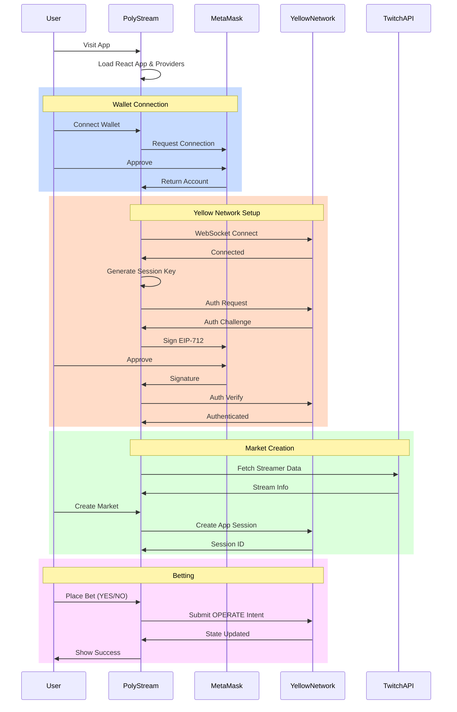

# PolyStream - Yellow Network Integration Documentation

## Table of Contents
1. [Overview](#overview)
2. [Architecture & Implementation](#architecture--implementation)
3. [Getting Started](#getting-started)
4. [Application Flow Diagrams](#application-flow-diagrams)
   - [Complete User Flow](#complete-user-flow)
   - [Authentication Flow](#authentication-flow)
   - [App Session Flow](#app-session-flow)
   - [Betting Flow](#betting-flow)
5. [Technology Stack](#technology-stack)
6. [Yellow Network Sandbox](#yellow-network-sandbox)

## Overview

PolyStream is a decentralized prediction market platform for gaming streamers, built on the Yellow Network using the Nitrolite SDK. It solves the problem of high costs and latency in traditional blockchain betting by utilizing Yellow Network's state channels for instant, gasless transactions.

### Problem Solved
- **High Costs and Latency**: Traditional on-chain prediction systems are slow and expensive
- **Web3 Complexity**: Yellow Network simplifies Web3 development with gasless transactions

### Key Features
- **Streaming Prediction Markets**: Binary outcome markets for Twitch/gaming events
- **State Channel Technology**: Off-chain transactions via Yellow Network
- **Gasless Operations**: Session keys enable free transactions
- **Real-time Updates**: WebSocket communication for live market data
- **EIP-712 Authentication**: Secure wallet-based authentication
- **Twitch Integration**: Live streamer data and events

## Architecture & Implementation

### Yellow Network Integration Pattern

The application uses Yellow Network's App Sessions as prediction markets:

```
App Session = Prediction Market
├── Participants
│   ├── User Wallet (Bettor)
│   ├── YES Pool (0x...0001)
│   └── NO Pool (0x...0002)
├── Allocations (Fund Distribution)
│   └── Tracked via OPERATE intents
└── Version Management
    └── Each bet increments version
```

### Core Components

#### 1. YellowClient (`lib/yellow/client.ts`)
- **WebSocket Connection**: Manages persistent connection to Yellow Network
- **Authentication**: Handles EIP-712 signature flow and session key generation
- **App Sessions**: Creates and manages prediction markets as app sessions
- **State Updates**: Submits bets using OPERATE intents

Key methods:
```typescript
connect()                 // Establish WebSocket connection
authenticate(wallet)      // EIP-712 auth with session key
createAppSession(request) // Create new prediction market
submitBet(...)           // Place bet via OPERATE intent
closeAppSession(...)     // Settle market and distribute funds
```

#### 2. InlineMarketOperations (`components/inline-market-operations.tsx`)
- Reusable betting UI component
- Manages version tracking for state updates
- Handles optimistic updates for better UX
- Calculates odds from pool allocations

#### 3. Provider Architecture (`app/providers.tsx`)
```
<QueryClientProvider>     // React Query for data fetching
  <WagmiProvider>         // Web3 wallet connection
    <YellowProvider>      // Yellow Network client context
      {children}
    </YellowProvider>
  </WagmiProvider>
</QueryClientProvider>
```

## Getting Started

### Prerequisites
- Node.js 20+
- MetaMask or compatible Web3 wallet
- Test funds (ytest.usd) from Yellow Network faucet

### Installation

```bash
# Clone repository
git clone [repository-url]
cd hackmoney-poly-stream

# Install dependencies
npm install

# Set up environment variables
cp .env.example .env
# Edit .env with your credentials:
# - NEXT_PUBLIC_SUPABASE_URL
# - NEXT_PUBLIC_SUPABASE_ANON_KEY
# - NEXT_PUBLIC_TWITCH_CLIENT_ID
# - TWITCH_CLIENT_SECRET

# Run development server (port 3001)
npm run dev
```

### Getting Test Tokens

Request test tokens from the Yellow Network sandbox faucet:

```bash
curl -XPOST https://clearnet-sandbox.yellow.com/faucet/requestTokens \
  -H "Content-Type: application/json" \
  -d '{"userAddress":"YOUR_WALLET_ADDRESS"}'
```

This will credit your account with ytest.usd tokens (usually 10,000,000 units = 10 tokens).

## Application Flow Diagrams

### Complete User Flow



### Authentication Flow

The EIP-712 authentication creates a session key for gasless operations:

```mermaid
flowchart TB
    Start([User Connects])
    GenKey[Generate Session Private Key<br/>viem: generatePrivateKey()]

    CreateSigner[Create ECDSA Signer<br/>for Session Key]

    PrepareAuth[Prepare Auth Request:<br/>- Main Wallet Address<br/>- Session Key Address<br/>- Allowances: 1B ytest.usd<br/>- Expiry: 24 hours<br/>- Application: PolyStream]

    SendAuthReq[Send auth_request<br/>via WebSocket]

    WaitChallenge{Receive<br/>auth_challenge?}

    CreateEIP712[Create EIP-712 Signer<br/>with Main Wallet]

    SignChallenge[Sign Challenge<br/>MetaMask Prompt]

    UserApprove{User<br/>Approves?}

    SendVerify[Send auth_verify<br/>with Signature]

    WaitSuccess{Receive<br/>Success?}

    AuthSuccess[✅ Authenticated<br/>Session Key Active]
    AuthFailed[❌ Auth Failed]

    Start --> GenKey
    GenKey --> CreateSigner
    CreateSigner --> PrepareAuth
    PrepareAuth --> SendAuthReq
    SendAuthReq --> WaitChallenge

    WaitChallenge -->|Yes| CreateEIP712
    WaitChallenge -->|Timeout| AuthFailed

    CreateEIP712 --> SignChallenge
    SignChallenge --> UserApprove

    UserApprove -->|Yes| SendVerify
    UserApprove -->|No| AuthFailed

    SendVerify --> WaitSuccess
    WaitSuccess -->|Success| AuthSuccess
    WaitSuccess -->|Error| AuthFailed

    style AuthSuccess fill:#9f9
    style AuthFailed fill:#f99
```

### App Session Flow

App Sessions are the core mechanism for prediction markets:

```mermaid
flowchart TB
    CreateMarket([Create Market])

    DefineParticipants[Define Participants:<br/>- User Wallet<br/>- YES Pool (0x...0001)<br/>- NO Pool (0x...0002)]

    InitAllocations[Initialize Allocations:<br/>User: Initial Funds<br/>YES Pool: 0<br/>NO Pool: 0]

    CreateSession[Create App Session<br/>via createAppSessionMessage()]

    SessionActive[Session Active<br/>Version: 1]

    UserBet{User Places<br/>Bet?}

    PrepareOperate[Prepare OPERATE Intent:<br/>- Move funds from User<br/>- Add to YES/NO Pool<br/>- Increment Version]

    SubmitState[Submit State Update<br/>via submitAppStateMessage()]

    UpdateSuccess[State Updated<br/>New Version]

    MarketResolve{Market<br/>Resolves?}

    CloseSession[Close App Session<br/>Distribute Final Allocations]

    MarketClosed[Market Closed<br/>Funds Distributed]

    CreateMarket --> DefineParticipants
    DefineParticipants --> InitAllocations
    InitAllocations --> CreateSession
    CreateSession --> SessionActive
    SessionActive --> UserBet

    UserBet -->|Yes| PrepareOperate
    UserBet -->|No| MarketResolve

    PrepareOperate --> SubmitState
    SubmitState --> UpdateSuccess
    UpdateSuccess --> UserBet

    MarketResolve -->|Yes| CloseSession
    MarketResolve -->|No| UserBet

    CloseSession --> MarketClosed

    style SessionActive fill:#bbf
    style UpdateSuccess fill:#9f9
    style MarketClosed fill:#f9f
```

### Betting Flow

Detailed betting process using OPERATE intents:

```mermaid
flowchart TB
    Start([User on Market])

    SelectOutcome{Select<br/>YES or NO?}

    EnterAmount[Enter Bet Amount<br/>in ytest.usd]

    CheckUser{User has<br/>Allocation?}

    AddAllocation[Add User to Allocations<br/>with Test Funds]

    CheckBalance{Sufficient<br/>Balance?}

    CalcNewAlloc[Calculate New Allocations:<br/>- Deduct from User<br/>- Add to Pool<br/>- Verify Sum Constant]

    IncrVersion[Increment Version<br/>versionRef.current++]

    CreateOperate[Create OPERATE Intent<br/>with New Allocations]

    SubmitBet[Submit via<br/>yellowClient.submitBet()]

    WaitConfirm{State<br/>Updated?}

    Success[✅ Bet Placed<br/>Update UI]
    Failed[❌ Bet Failed]

    Start --> SelectOutcome
    SelectOutcome --> EnterAmount
    EnterAmount --> CheckUser

    CheckUser -->|No| AddAllocation
    CheckUser -->|Yes| CheckBalance

    AddAllocation --> CheckBalance

    CheckBalance -->|No| Failed
    CheckBalance -->|Yes| CalcNewAlloc

    CalcNewAlloc --> IncrVersion
    IncrVersion --> CreateOperate
    CreateOperate --> SubmitBet
    SubmitBet --> WaitConfirm

    WaitConfirm -->|Success| Success
    WaitConfirm -->|Error| Failed

    style Success fill:#9f9
    style Failed fill:#f99
```

## Technology Stack

### Core Stack
| Component | Technology | Purpose |
|-----------|------------|---------|
| **Framework** | Next.js 16 (App Router) | Full-stack React framework |
| **Language** | TypeScript 5.2 | Type safety |
| **Styling** | Tailwind CSS + shadcn/ui | Modern UI components |
| **State** | React Query + Wagmi | Data fetching & Web3 state |
| **Database** | Supabase | User data & market metadata |

### Yellow Network Integration
| Component | Technology | Purpose |
|-----------|------------|---------|
| **SDK** | @erc7824/nitrolite 0.5.3 | Yellow Network protocol |
| **Auth** | EIP-712 Signatures | Secure wallet authentication |
| **Transport** | WebSocket | Real-time communication |
| **Session Keys** | Viem accounts | Gasless operations |

### External Integrations
| Service | Purpose |
|---------|---------|
| **Twitch API** | Streamer data and events |
| **MetaMask** | Wallet connection |
| **Yellow Network** | State channels |

## Yellow Network Sandbox

### Environment Details
- **WebSocket URL**: `wss://clearnet-sandbox.yellow.com/ws`
- **Faucet URL**: `https://clearnet-sandbox.yellow.com/faucet/requestTokens`
- **Test Token**: `ytest.usd` (6 decimals)
- **Session Expiry**: 24 hours
- **Default Allowance**: 1 billion ytest.usd

### Configuration (`lib/yellow/config.ts`)
```typescript
export const YELLOW_CONFIG = {
  CLEARNODE_WS_URL: 'wss://clearnet-sandbox.yellow.com/ws',
  APPLICATION_NAME: 'PolyStream',
  SESSION_KEY_EXPIRY: 86400, // 24 hours
  SESSION_KEY_SCOPE: 'session',
  DEFAULT_ALLOWANCES: [
    { asset: 'ytest.usd', amount: '1000000000' }
  ]
};
```

### Key Concepts

#### App Sessions as Markets
- Each prediction market is a Yellow Network App Session
- Participants include user wallets and pool addresses
- Allocations track fund distribution
- OPERATE intents move funds between participants

#### Version Management
- Each state change increments the version
- Version 1: Initial market creation
- Version 2+: Each bet or state update
- Critical for concurrent operations

#### Gasless Operations
- Session keys enable free transactions
- Main wallet signs once during auth
- All subsequent operations use session key
- No gas fees for users

## Development Commands

```bash
# Development
npm run dev          # Start dev server (port 3001)

# Build & Production
npm run build        # Create production build
npm start           # Start production server

# Code Quality
npm run typecheck   # TypeScript type checking
npm run lint        # ESLint checks
```

## Architecture Patterns

### Design Patterns
1. **Client Wrapper Pattern**: YellowClient encapsulates SDK complexity
2. **Provider Pattern**: Context providers for global state
3. **Optimistic Updates**: Update UI before confirmation
4. **Version Tracking**: Manage concurrent state updates
5. **Component Composition**: Reusable betting interface

### Key Architectural Decisions
1. **Next.js App Router**: Modern React server components
2. **State Channels**: Off-chain for instant, free transactions
3. **Session Keys**: 24-hour keys for gasless operations
4. **Inline Operations**: Embedded betting UI in market cards
5. **WebSocket Events**: Real-time market updates

### Security Considerations
1. **EIP-712 Signatures**: Typed, structured data signing
2. **Session Key Isolation**: Temporary keys with limited scope
3. **Allowance Limits**: Predefined spending limits
4. **Environment Variables**: Secure credential management
5. **Client-side Validation**: Amount and balance checks

## Future Enhancements

### Planned Features
- **Oracle Integration**: Automated market resolution
- **Multiple Markets**: Concurrent prediction markets
- **Liquidity Pools**: AMM-style market making
- **Mobile App**: React Native version
- **Analytics Dashboard**: Market statistics

### Technical Improvements
- **Production Network**: Mainnet deployment
- **IPFS Storage**: Decentralized market data
- **Push Notifications**: Real-time updates
- **Multi-chain**: Cross-chain markets
- **Advanced Orders**: Limit orders, stop-loss