# Yellow App - Architecture Documentation

## Table of Contents
1. [Overview](#overview)
2. [C4 Model Diagrams](#c4-model-diagrams)
   - [Context Diagram](#c1-context-diagram)
   - [Container Diagram](#c2-container-diagram)
   - [Component Diagram](#c3-component-diagram)
3. [Application Flow Diagrams](#application-flow-diagrams)
   - [Complete User Flow](#complete-user-flow)
   - [Authentication Flow](#authentication-flow)
   - [Betting Flow](#betting-flow)
4. [Technology Stack](#technology-stack)

## Overview

Yellow App is a decentralized prediction market platform built on the Yellow Network using the Nitrolite SDK. It enables users to create and participate in prediction markets using state channels for scalable, low-cost transactions on the Sepolia testnet.

**The Complete flow is:**
1. Connect
2. Authenticate
3. Define App
4. Create Session
5. Update State
6. Close

### Key Features
- **Decentralized Prediction Markets**: Binary outcome markets (YES/NO)
- **State Channel Technology**: Off-chain transactions via Yellow Network
- **Web3 Integration**: MetaMask wallet connection
- **Real-time Updates**: WebSocket communication for live market data
- **Session-based Authentication**: EIP-712 signature-based auth

## C4 Model Diagrams

### C1: Context Diagram

This diagram shows how the Yellow App interacts with external actors and systems.

```mermaid
graph TB
    subgraph "External Actors"
        User[👤 User<br/>Market Participant]
        Admin[👨‍💼 Admin<br/>Market Creator]
    end

    subgraph "Yellow App System"
        YellowApp[Yellow App<br/>Prediction Market Platform]
    end

    subgraph "External Systems"
        MetaMask[MetaMask<br/>Web3 Wallet]
        YellowNetwork[Yellow Network<br/>State Channel Service]
        Blockchain[Sepolia Blockchain<br/>Ethereum Testnet]
        IPFS[IPFS<br/>Decentralized Storage]
    end

    User -->|Places bets,<br/>Views markets| YellowApp
    Admin -->|Creates markets,<br/>Resolves outcomes| YellowApp

    YellowApp -->|Wallet operations| MetaMask
    YellowApp -->|State channel ops,<br/>WebSocket msgs| YellowNetwork
    YellowApp -->|Smart contract calls| Blockchain
    YellowApp -.->|Future: Store data| IPFS

    MetaMask -->|Signs transactions| Blockchain
    YellowNetwork -->|Settlement| Blockchain

    style YellowApp fill:#f9f,stroke:#333,stroke-width:4px
    style User fill:#bbf,stroke:#333,stroke-width:2px
    style Admin fill:#bbf,stroke:#333,stroke-width:2px
```



### C2: Container Diagram

This diagram breaks down the Yellow App system into its major containers (applications/services).


### C3: Component Diagram

This diagram shows the internal components of the React application.


## Application Flow Diagrams

### Complete User Flow

This diagram shows the complete user journey from landing to placing a bet.


### Authentication Flow

Detailed authentication flow using EIP-712 signatures.


### Betting Flow

The process of placing a bet on a prediction market.


## Technology Stack

### Frontend
- **Framework**: React 19.2 with TypeScript
- **Build Tool**: Vite 7.2
- **Styling**: Tailwind CSS 3.4
- **State Management**: Zustand 5.0
- **Routing**: React Router DOM 7.13

### Web3 Integration
- **Wallet Connection**: Wagmi 2.5
- **Blockchain Interaction**: Viem 2.45
- **Network**: Sepolia Testnet
- **State Channels**: @erc7824/nitrolite 0.5.3

### Communication
- **Real-time**: Native WebSocket API
- **Protocol**: Yellow Network Custom Protocol
- **Authentication**: EIP-712 Signatures

### Development
- **Language**: TypeScript 5.9
- **Linting**: ESLint 9.39
- **Package Manager**: npm
- **Node Version**: 24.10+

## Architecture Patterns

### Design Patterns Used
1. **Service Layer Pattern**: Business logic separated into service modules
2. **Store Pattern**: Centralized state management with Zustand
3. **Singleton Pattern**: Single instances for WebSocket, Auth, and Channel managers
4. **Event-Driven Architecture**: WebSocket events drive state updates
5. **Component Composition**: Reusable UI components

### Key Architectural Decisions
1. **Client-Side Only**: No backend server, direct connection to Yellow Network
2. **State Channels**: Off-chain transactions for scalability
3. **Session Keys**: Temporary keys for transaction signing
4. **Optimistic Updates**: Update UI before confirmation for better UX
5. **WebSocket Reconnection**: Automatic reconnection with exponential backoff

### Security Considerations
1. **Session Key Generation**: Client-side generation of temporary keys
2. **EIP-712 Signatures**: Typed structured data signing
3. **Allowance Limits**: Predefined spending limits for sessions
4. **Expiry Times**: 1-hour session expiry for security
5. **Environment Variables**: Sensitive config in .env files

## Data Flow

### State Management Flow
```
User Action → Component → Service → WebSocket → Yellow Network
                ↓                        ↓
            Store Update ← ← ← ← ← Response
                ↓
            UI Re-render
```

### Market Data Flow
```
Market Service → Local State (Optimistic)
        ↓
    WebSocket → Yellow Network
        ↓
    Confirmation → Update State → Refresh UI
```

### Channel Balance Flow
```
Deposit → Blockchain TX → Channel Contract
                              ↓
                    Yellow Network Update
                              ↓
                    WebSocket Notification
                              ↓
                        Update Store
```

## Deployment Architecture

### Current Setup (Development)
- **Frontend**: Vite Dev Server (localhost:5173)
- **Network**: Sepolia Testnet
- **WebSocket**: Yellow Network Test Environment

### Production Considerations
- **Frontend Hosting**: Static site (Vercel/Netlify/IPFS)
- **Network**: Mainnet or L2 (Polygon, Arbitrum)
- **WebSocket**: Production Yellow Network
- **CDN**: CloudFlare for static assets
- **Monitoring**: Error tracking and analytics

## Future Enhancements

### Planned Features
1. **Multi-Market Support**: Multiple simultaneous markets
2. **Market Categories**: Sports, Politics, Crypto, etc.
3. **Liquidity Pools**: AMM-style market making
4. **Mobile App**: React Native version
5. **Analytics Dashboard**: Market statistics and trends

### Technical Improvements
1. **Server-Side Rendering**: Next.js for SEO
2. **GraphQL API**: For complex queries
3. **IPFS Integration**: Decentralized data storage
4. **Push Notifications**: Market updates
5. **Multi-Chain Support**: Cross-chain markets